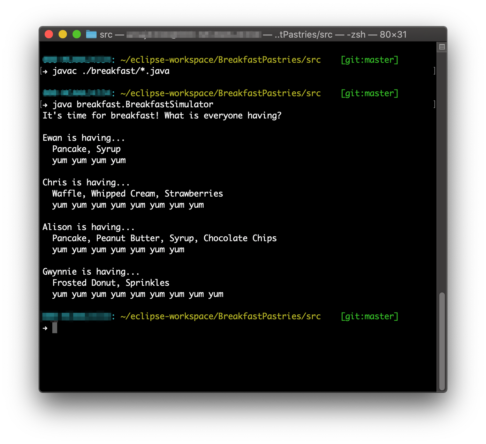

# Breakfast Builder

This is a simple breakfast building simulator that demonstrates the Decorator Pattern.

## Decorator Pattern Definition

> **The Decorator Pattern** attaches additional responsibilities to an object dynamically. Decorators provide a flexible alternative to subclassing for extending functionality.

## This Project

**Pastry** will act as our abstract component class.

**Pancake**, **Waffle**, and **FrostedDonut** are our concrete components. One for each pastry type available.

**ChocolateChips**, **PeanutButter**, **Sprinkles**, **Strawberries**, **Syrup**, and **WhippedCream** are our topping decorators.

To see the classes in action, we can run `BreakfastSimulator.java` which has some pastries built using our components.

